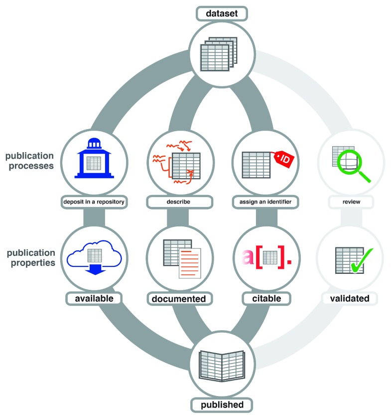

# Data Publications
- [Benefits of data publications](#Benefits-of-data-publications)
- [Data papers & data journals](#Data-papers-&-data-journals)
- [Data journals](#Data-journals)
- [Data repositories](#Data-repositories)
- [How does DataPLANT support me in data publication?](#How-does-DataPLANT-support-me-in-data-publications?)

Data Publication, or data publishing, is defined as releasing your research data in a published form. This will allow others to access and use your datasets. Writing a manuscript can sometimes consume a lot of time. Some researchers might find this process tedious if they only want to publish certain data, which they considered as interesting or impactful during and after collection. Data publishing is an integral part of the open science movement. In general, the main goal is to evolve data to first class research outputs, driven by a number of initiatives. This enables datasets to be cited similarly to other research publication types, such as articles or books, enabling producers of datasets to gain academic credit for their work.

There are a several criteria that should be fulfilled during publication of your dataset:
1. Of course, your data needs to be hosted in a repository to make it available for everyone. Various repositories exist, which have  been developed to support data publication, e.g. [Zenodo](https://zenodo.org/), including general, but also domain-specific data repositories exist.
2. Your dataset needs to be well annotated, allowing other researchs to understand and reuse your data. 
3. Your dataset needs to be assigned a persistent identifier (PID), such as a DOI. This can be assigned directly on the repository or with the help of a publication service, such as [Invenio](https://inveniosoftware.org/products/rdm/). The identifier will others to cite your dataset.
4. In case the publisher validates your data, which is not always the case, he will review your metadata annotation to ensure comprehensibility.

There is also the possibility for publishing a data paper about the dataset, which may be published as a preprint, in a journal, or in a data journal that is dedicated to supporting data papers. The data may be hosted by the journal or hosted separately in a data repository. For more information see [data papers & data journals](#Data-papers-&-data-journals)

**Figure 1:** During publication, datasets are typically deposited in a repository to make them available, documented to support reproduction and reuse, and assigned an identifier to facilitate citation. Some, but not all, publishers review datasets to validate them.

## Benefits of data publications
The motivations for publishing data may range for a desire to make research more accessible, to enable citability of datasets, or research funder or publisher mandates that require open data publishing. Some scientists might argue that they would uncomfortable about publishing their dataset, as it could allow people to copy my work from the web and plagiarize it. However, most print-based science journals are available online nowadays, so the potential of copying is already present. Additionally, solutions to preserve privacy within data publishing has been proposed, including privacy protection algorithms, data ”masking” methods, and regional privacy level calculation algorithm. 
In general, the advantages of data publications prevail. Here is a list of some potential benefits you might get from publishing your dataset:
- Data can be reused for similar and new purposes
- Data can be integrated with other data to create new data resources
- Invitations to collaborate
- Invitations to provide consultancy
- Greater citation rate
- Citation of data publications is likely to increase citations of related research papers
- Wider recognition among peers
- Overall acceleration of science and better science
- ... 

## Data papers & data journals
Data papers or data articles are “scholarly publications of a searchable metadata document describing a particular on-line accessible dataset, or a group of datasets, published in accordance to the standard academic practices”. The intent of a data paper is to offer a descriptive information on the related dataset(s) focusing on data collection and distinguishing features, rather than on data processing and analysis. Thereby, their aim is answering questions like "What data was published?", "How was the data collected?", or "Who collected the data?" As data papers are considered academic publications, just as other types of papers, they allow scientists sharing data to receive credit and thus, upgrading the value of data sharing. This provides not only an additional incentive to share data, but also increases metadata quality and reusability of the shared data.

Data papers are supported by a variety of journals, of which some are "true" data journals, i.e. they are dedicated to publish data papers only, while the majority are mixed journals meaning they publish a number of articles types, including data papers. A list of data journals can be found [here](https://www.researchdata.uni-jena.de/en/information/data-publication) 

## How does DataPLANT support me in data publications?
- ARC
- DataHub
- Invenio

## Sources and further information
- [Data publication: towards a database of everything](https://doi.org/10.1186/1756-0500-2-113)
- [Motivating Online Publication of Data](https://doi.org/10.1525/bio.2009.59.5.9)
- [Data publication consensus and controversies](https://dx.doi.org/10.12688%2Ff1000research.3979.3)
- [Making Data a First Class Scientific Output](https://doi.org/10.2218/ijdc.v7i1.218)
- [The data paper](https://dx.doi.org/10.1186%2F1471-2105-12-S15-S2)